# 🌿 MindEase – Stress Level Predictor & Support App

**🔗 Live Site:** [https://mind-ease-y8dq.vercel.app](https://mind-ease-y8dq.vercel.app)  
**📧 Contact:** dharanimanchala48@gmail.com  

---

## 🧠 About the Project

MindEase is a mental wellness web application that helps users identify their stress levels (Low, Medium, High) through a series of questions and offers personalized recommendations, visual analytics, and optional relaxation games. Designed with simplicity and clarity in mind, it supports users in tracking and improving their mental well-being.

---

## ⚙️ Features

- 🧪 ML-powered stress level prediction (based on user responses)
- 📊 Visual analytics: progress bar, timeline, and charts
- 📚 Effects of stress and wellness tips
- 🎮 Three simple games for stress relief
- 🗂️ Weekly history and result tracking
- 🌐 Fully responsive UI

---

## 💡 Tech Stack

- **Frontend**: HTML, CSS, JavaScript  
- **Backend & ML**: Python, Flask (custom-trained dataset)  
- **Visualizations**: Chart.js  
- **Deployment**: GitHub + Vercel  

---

## 📘 Notes

- Custom ML model trained on a dataset of 100+ entries
- Each stress level leads to different suggestions
- Optional games enhance user engagement
- History page visualizes last 7 days of stress levels

---

## 🏁 Future Enhancements

- 🔐 User login and profiles  
- 🧘 More games and relaxation tools  
- 🌍 Multi-language support  

---## 📸 Screenshots

### 🏠 Home Page

  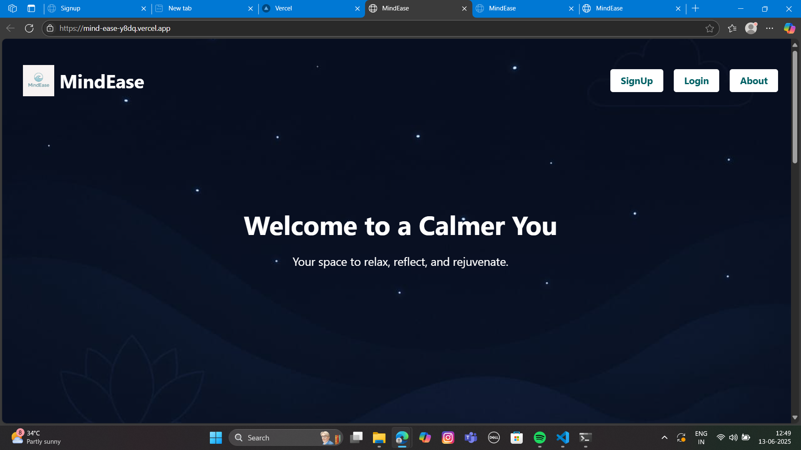
  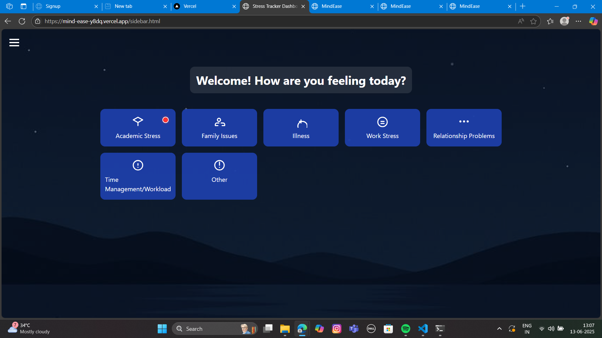

### ❓ Questions (User Input Screens)

  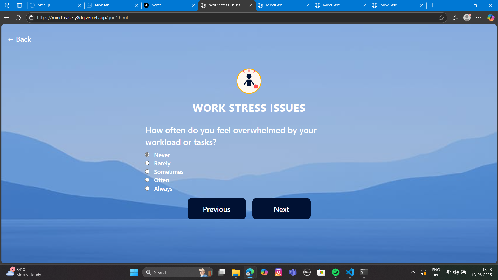
  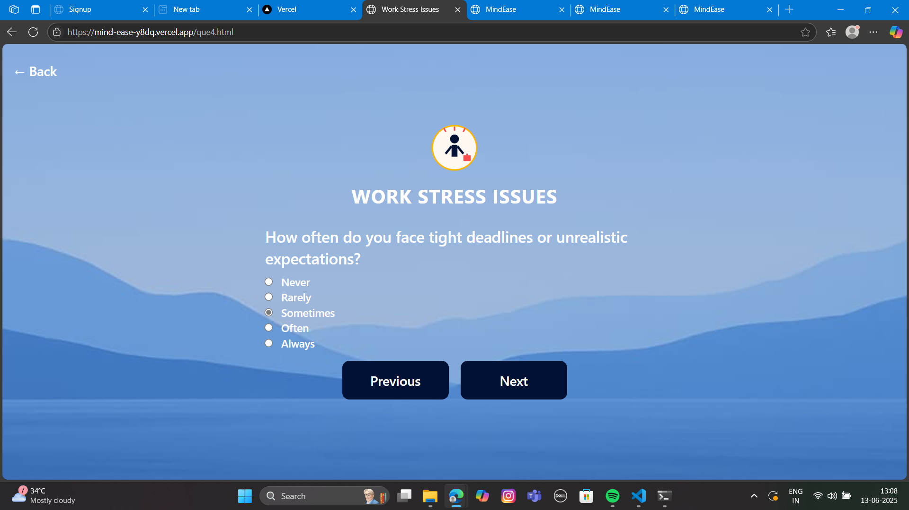

  
  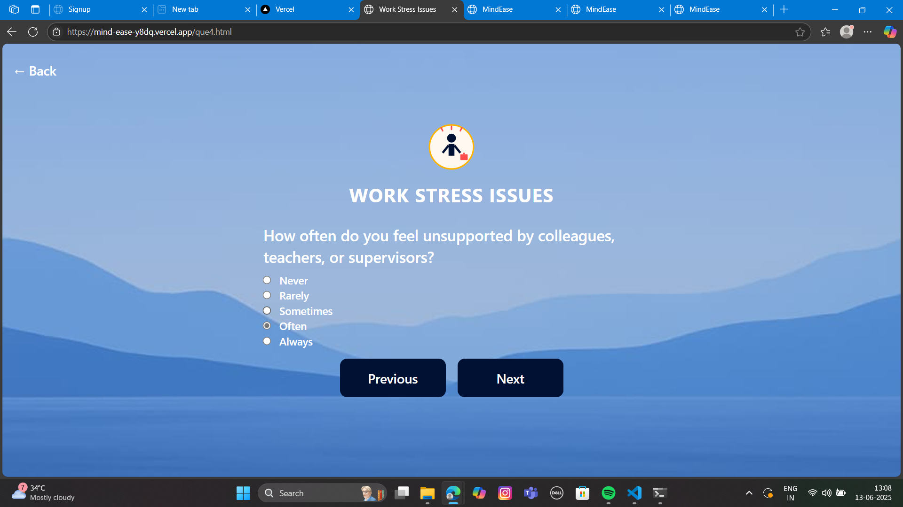

  
  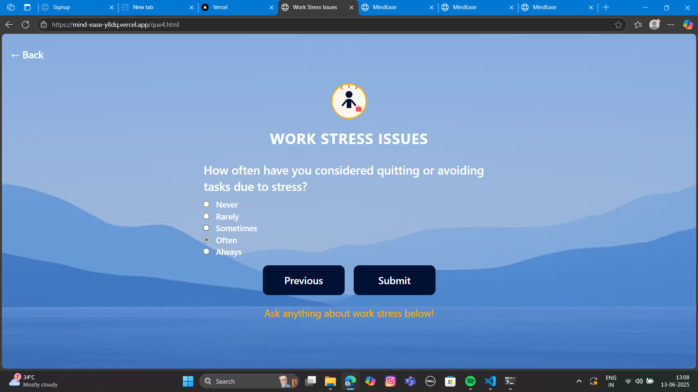

  

### 📈 Stress Results

  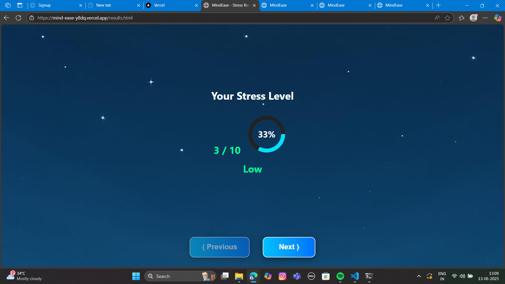
  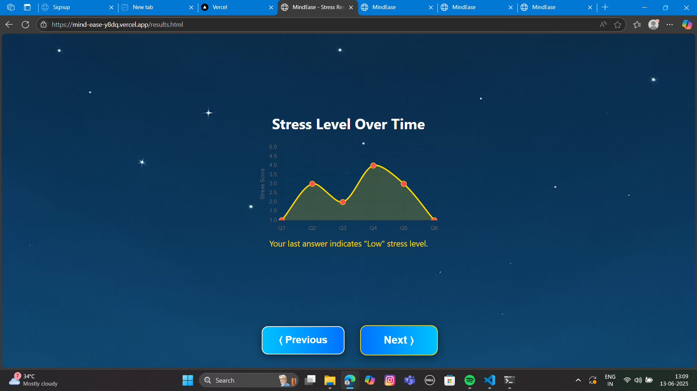

  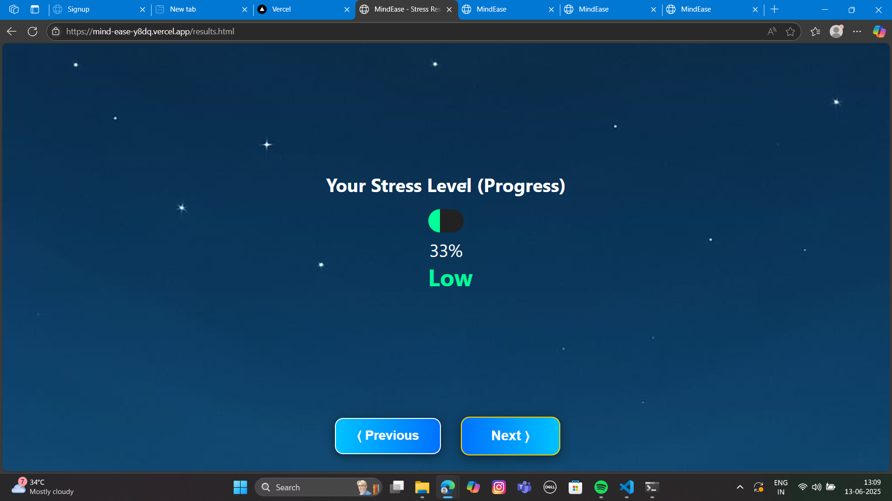
  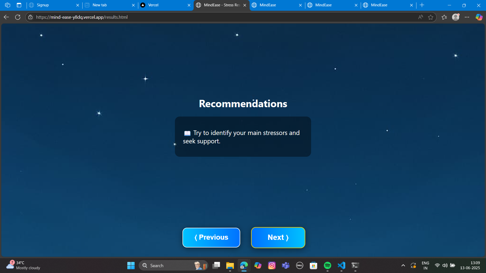

  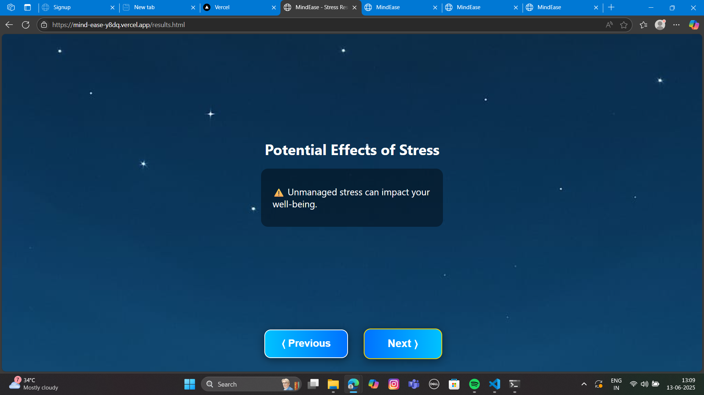
  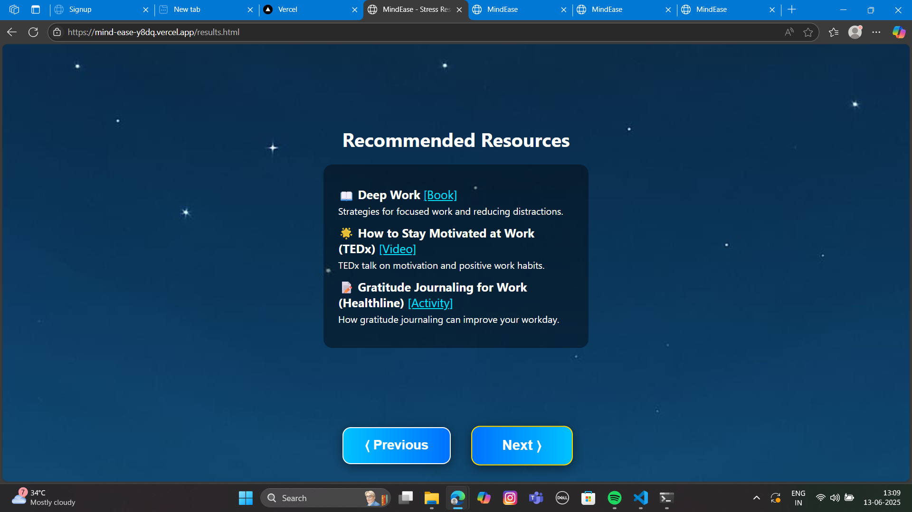

  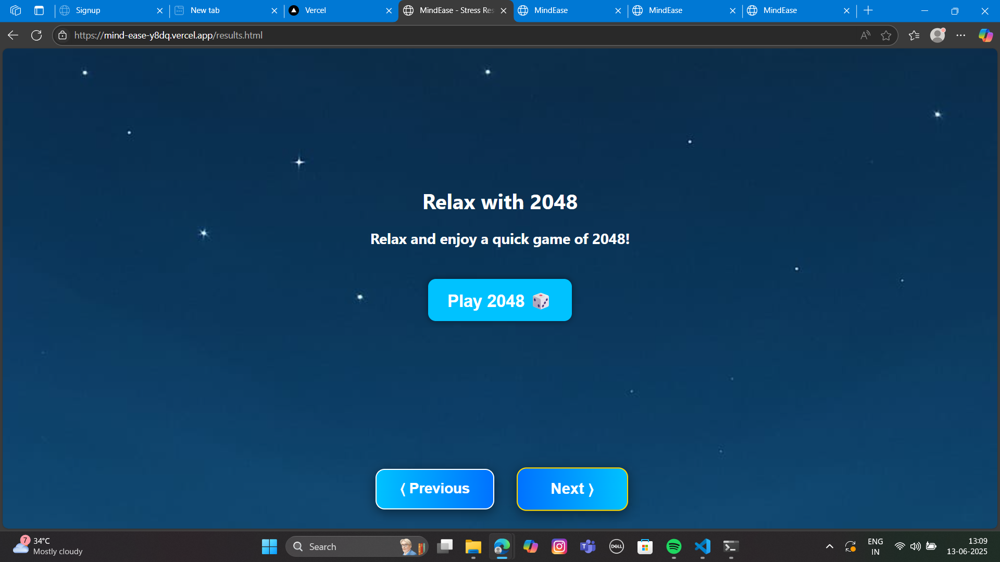

🧭 Final Page – Action Buttons

  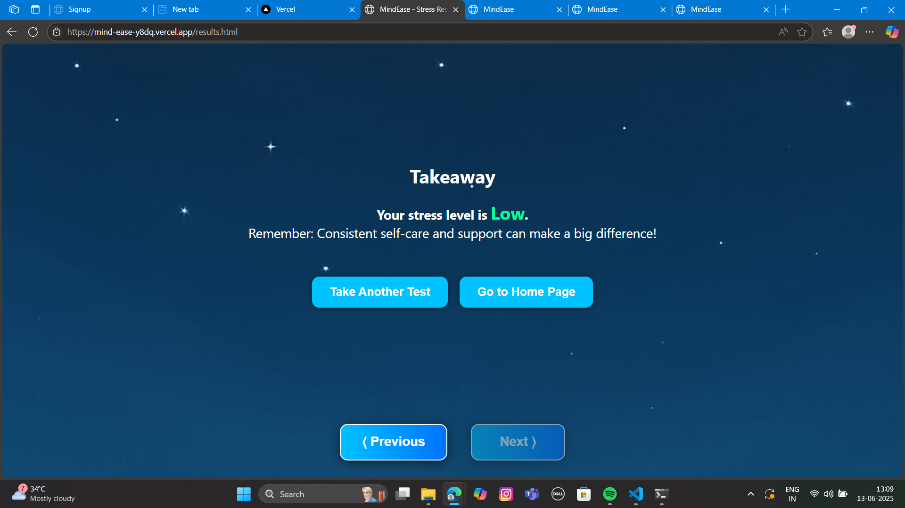

## 🙌 Support & Feedback

If you find this helpful or want to contribute:
- ⭐ Star this repo
- 🐛 Open issues or feature requests
- 💬 Email me at dharanimanchala48@gmail.com

---

**Built with ❤️ by Dharani Manchala**
